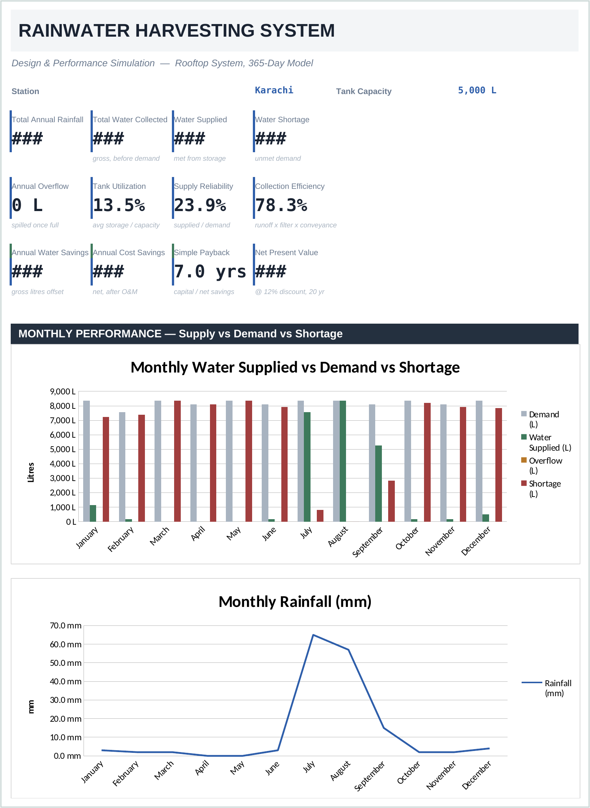
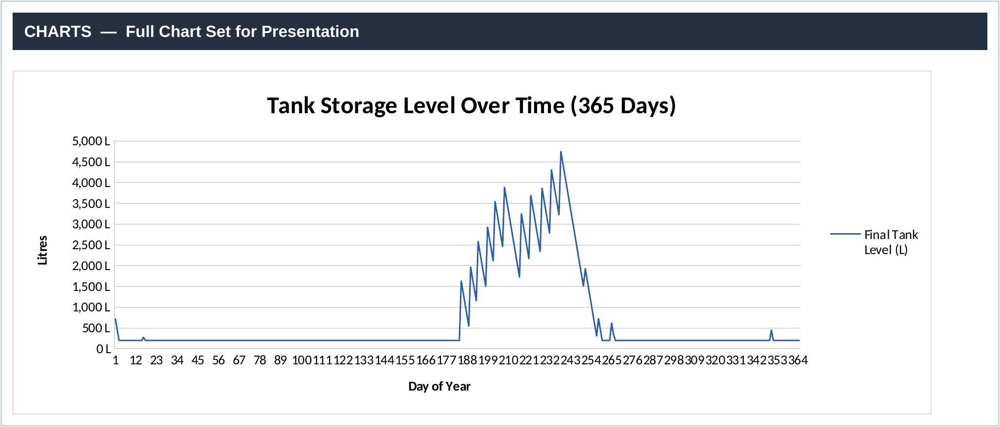
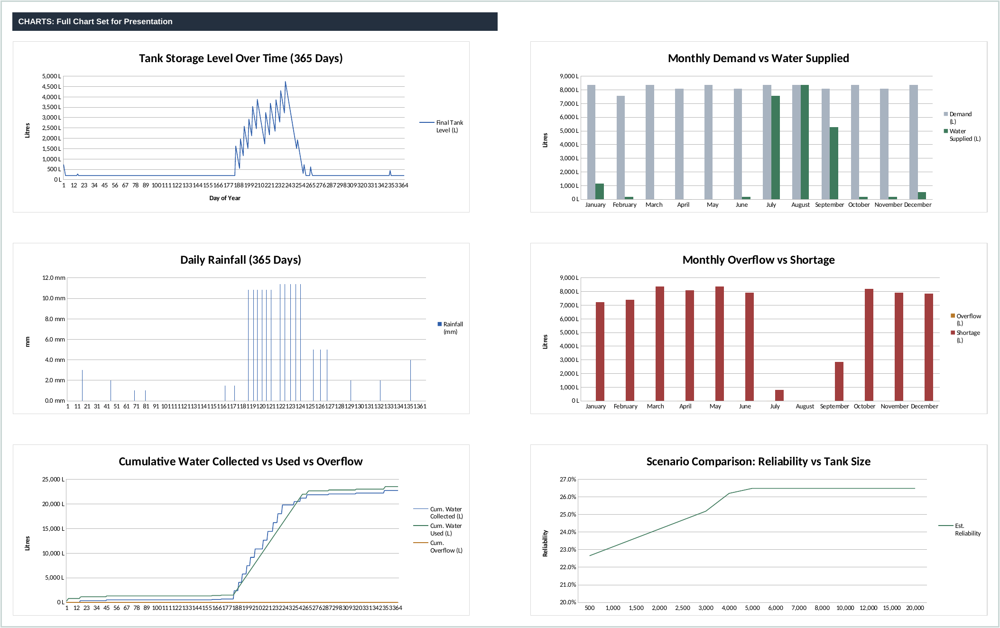
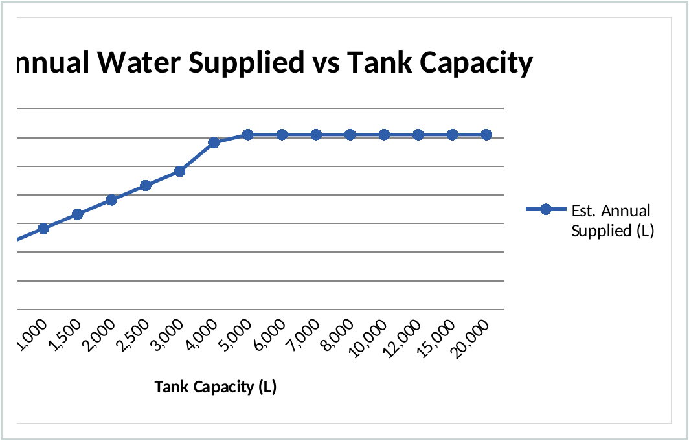
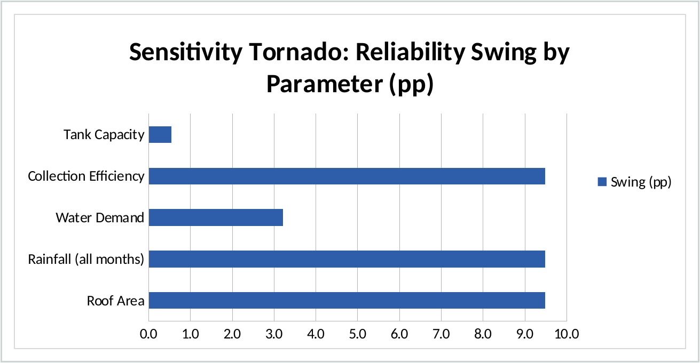
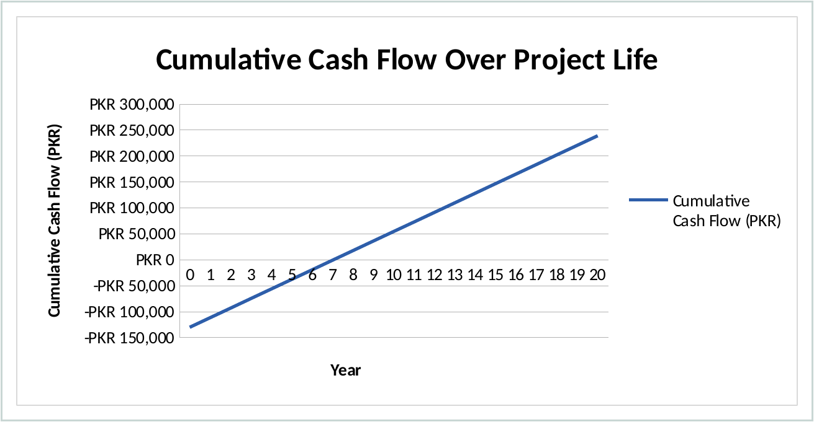

# Rainwater Harvesting System: Design & Performance Simulation

Made by Umair 

Student at NUST Karachi

*A 365-day water balance model for sizing and evaluating rooftop rainwater harvesting systems, built entirely in Microsoft Excel.*


> This is a personal/academic engineering project, not a certified design tool. Treat the outputs as a preliminary sizing estimate, not a substitute for a proper hydraulic design signed off by a licensed engineer.

---

## Overview

Karachi gets about 155 mm of rain a year, most of it packed into a six-week window across July and August. That kind of rainfall pattern makes tank sizing genuinely hard to get right by intuition, so this project runs a full 365-day mass balance in Excel instead of relying on a rule of thumb.

The workbook tracks rainfall collection, tank storage, water supply, overflow, and shortage on a daily basis for a full year, then uses that simulation to size the storage tank, test how sensitive the design is to different assumptions, and check whether the system pays for itself.

Excel was a deliberate choice, not a shortcut. Every formula is visible and auditable, there's no dependency on a hydrology package or a script someone else has to install, and the whole thing runs on Solver plus native functions like SUMPRODUCT and INDEX/MATCH. The engineering underneath is straightforward: conservation of mass applied to the tank as a control volume, a runoff coefficient model for roof collection, and standard NPV/IRR analysis for the economics.

---

## Features

- 365-day daily mass balance simulation (not a monthly approximation)
- Rainfall data for five Pakistani cities, with a manual entry option
- Automatic daily rainfall disaggregation from monthly normals
- Tank storage and dead-storage modeling with correct conservation of mass
- Monthly performance rollups: rainfall, supply, shortage, overflow, reliability
- Tank size optimization using Excel Solver (GRG Nonlinear)
- Independent formula-driven capacity sweep as a cross-check on Solver
- One-at-a-time sensitivity analysis with a tornado chart
- 20-year economic evaluation: payback period, NPV, IRR
- Dashboard with KPI cards and monthly charts
- Named ranges throughout, no hardcoded cell references buried in formulas

---

## Dashboard Preview

| | |
|---|---|
|  <br> **Dashboard** |  <br> **Daily Simulation** |
|  <br> **Chart Set** |  <br> **Tank Optimization** |
|  <br> **Sensitivity Analysis** |  <br> **Economic Analysis** |

---

## Workbook Structure

| Sheet | Description |
|---|---|
| Dashboard | KPI cards and monthly charts, single-page summary |
| Inputs | Editable parameters: roof, tank, demand, location, cost |
| Rainfall Data | Monthly normals for five stations, plus the derived daily series |
| Daily Simulation | Day-by-day mass balance across the full year |
| Monthly Summary | Daily results rolled up by month, including reliability |
| Engineering Calcs | Governing equations and stated assumptions |
| Tank Optimization | Solver setup, capacity sweep, sizing recommendation |
| Sensitivity | One-at-a-time parameter tests, tornado chart |
| Economics | Capital cost, savings, payback, NPV, IRR |
| Charts | Full chart set referenced in the report |

---

## Engineering Methodology

<details>
<summary><strong>Rainfall Collection</strong></summary>

```
V = (P - D_ff) × A × 1000        [litres]
```

`P` = rainfall depth (mm), `D_ff` = first-flush depth diverted (mm), `A` = roof area (m²).
1 mm of rain over 1 m² is 1 litre, so no unit conversion is needed beyond the first-flush subtraction.

</details>

<details>
<summary><strong>Collection Efficiency</strong></summary>

```
η = C × η_filter × η_convey
```

`C` is the runoff coefficient (roof-material dependent, 0.80-0.90 for metal roofing). The other two terms account for filter and conveyance losses.

</details>

<details>
<summary><strong>Tank Mass Balance</strong></summary>

```
S(t) = MIN[ S(t-1) + V - Q_supply - Q_overflow , S_cap ]
```

Conservation of mass applied to the tank as a control volume, solved day by day across the year. Supply and overflow are each bounded by `MIN`/`MAX` terms so storage never goes negative or exceeds capacity.

</details>

<details>
<summary><strong>Reliability</strong></summary>

```
R = ΣQ_supply / ΣQ_demand
```

Volumetric fraction of annual demand actually met by the system.

</details>

<details>
<summary><strong>Optimization</strong></summary>

Tank capacity is optimized in Excel Solver to maximize annual water supplied, using the **GRG Nonlinear** method. This is required, not optional: the MIN/MAX terms in the balance make the supply-vs-capacity response piecewise rather than linear, which rules out Simplex LP.

</details>

<details>
<summary><strong>Economic Evaluation</strong></summary>

Standard capital budgeting: simple payback, plus NPV and IRR discounted over a 20-year horizon against the tank and installation cost.

</details>

---

## Results

Typical output for the Karachi base case (220 m² roof, 5,000 L tank, 6-person household):

| Metric | Value |
|---|---|
| Annual rainfall (Karachi) | ~155 mm |
| Water collected | 22,746 L |
| Water supplied | 23,546 L |
| Overflow | 0 L |
| Shortage | 75,004 L |
| Annual reliability | 23.9% |
| Tank utilization | 13.5% |
| Recommended tank size | 3,000 L (98% of achievable supply) |
| Simple payback | 7.0 years |
| NPV (12% discount, 20 yr) | ~PKR 7,900 |
| IRR | ~13.0% |

These numbers are specific to Karachi's rainfall and this particular roof and demand combination. Change the rainfall station or any input on the Inputs sheet and every downstream number, including the dashboard, recalculates automatically.

---

## Technologies Used

| Tool / Method | Purpose |
|---|---|
| Microsoft Excel | Simulation engine, all formulas and named ranges |
| Excel Solver (GRG Nonlinear) | Tank capacity optimization |
| SUMPRODUCT, INDEX/MATCH | Data lookups and monthly aggregation |
| Conditional formatting, data validation | Dashboard interactivity |
| Engineering economics (NPV, IRR, payback) | Financial feasibility |
| Sensitivity analysis (one-at-a-time) | Parameter importance ranking |

---

## Repository Structure

```text
Rainwater-Harvesting-Simulation/
│
├── README.md
├── Rainwater_Harvesting_System_Model.xlsx
├── Engineering_Report.pdf
├── images/
│   ├── banner.png
│   ├── dashboard.png
│   ├── simulation.png
│   ├── charts.png
│   ├── optimization.png
│   ├── sensitivity.png
│   └── economics.png
├── data/
│   └── rainfall_normals.csv
└── LICENSE
```

---

## How to Use

1. Download `Rainwater_Harvesting_System_Model.xlsx`.
2. Open it in Excel. The Tank Optimization sheet needs the Solver add-in enabled (`File > Options > Add-ins > Excel Add-ins > Solver Add-in`).
3. Go to the **Inputs** sheet and set your roof area, tank size, demand, and rainfall station.
4. Run Solver on the **Tank Optimization** sheet if you want the capacity re-optimized for your inputs.
5. Check the **Dashboard** for the summary, or open **Daily Simulation** for the full day-by-day breakdown.

---

## Future Improvements

- Replace the synthetic daily rainfall distribution with real PMD daily station records
- Greywater integration as a second, steadier supply stream
- Low-cost IoT tank-level sensor to validate the simulated storage curve against real data
- Seasonal (rather than flat) demand modeling
- Climate scenario testing for monsoon variability
- GIS-based roof area estimation for multi-building sites

---

## Screenshots

<details>
<summary>Click to expand full-size screenshots</summary>


</details>

---

## License

This project is licensed under the MIT License. See [LICENSE](LICENSE) for details.

---

## Contact

**GitHub:** [@umairamir1305](https://github.com/umairamir1305)
**Mail:** umairamir1305@gmail.com
